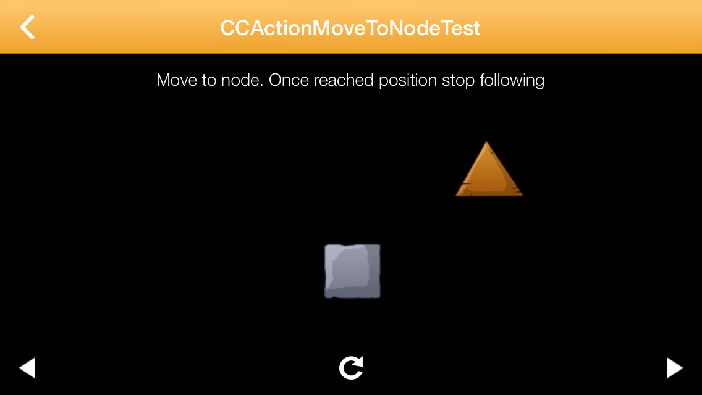

#A Cocos2d 3.0 Action that makes one Node follow another (moving) Node

This action can be applied to any Node to let it move to or follow another Node. This action behaves correctly even when the target Node is moving.

#Installation
Simply grab `CCActionMoveToNode.m` and `CCActionMoveToNode.h` and add them to your project.

#Usage

##Move to a Node
    CCActionMoveToNode *moveTo = [CCActionMoveToNode actionWithSpeed:100.f targetNode:_spriteToFollow];
    [_followingSprite runAction:moveTo];
    
##Follow a Node infinitely
    CCActionMoveToNode *moveTo = [CCActionMoveToNode actionWithSpeed:100.f targetNode:_spriteToFollow followInfinite:YES];
    [_followingSprite runAction:moveTo];

##Get informed when target node is reached
    moveTo.actionCompletedBlock = ^(void) {
        [self.contentNode addChild:completedLabel];
    };

##Provide the target position through a block
Assuming you want to follow a certain position within a target node you also have the possibility to provide the target position through a block:

    CCActionMoveToNode *moveTo = [CCActionMoveToNode actionWithSpeed:100.f positionUpdateBlock:^CGPoint{
        return _spriteToFollow.position;
    }];
    [_followingSprite runAction:moveTo];

#More examples
Take a look at `CCActionMoveToNodeTest.m` for more examples. If you run this app it will let you switch through the different implemented tests that show off the different ways to use this API. Thanks @ Viktor from Apportable for this great test framework.